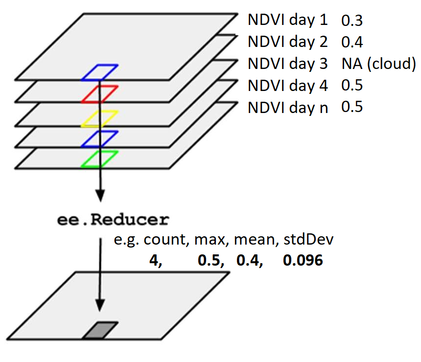
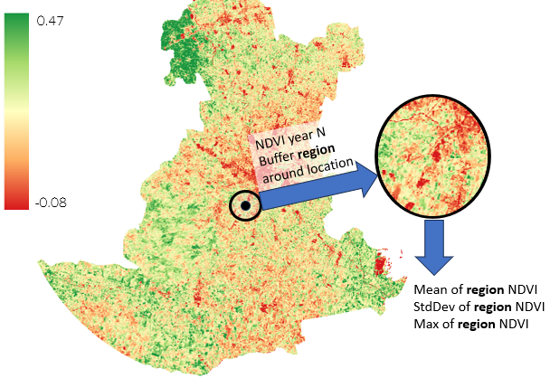

# Eating Disorders Exposure to Green

## Method

We buffer position of residential location of case around 1 km and estimate the yearly exposure to green areas by using the Landsat series for calculating the NDVI index.

Data are aggregated temporally over the year first, then spatially over a region of 1 km buffer around the location of the observed case. The column names therefore show the aggregating operator used in time first (TTT), and in the region second (RRR). Thus columns are named NDVI_TTT_RRR. TTT can be count, max, mean and standard deviation (stdDev), RRR can be max, mean and stdDev.

E.g. values of counts of the valid cells with NDVI (no clouds) available in the Landsat images over the year and then taking the average of those values in the buffer region are stored in the column "NDVI_count_mean". "NDVI_count_max" mean the maximum number of cells in the region counted over the year. "NDVI_mean_mean" means the average NDVI over the year in each cell, and then the overall average in the buffer region. "NDVI_max_mean" is the maximum temporal NDVI for each cell, and then the average of the maximum values in the region. "NDVI_max_max" is the maximum NDVI value in the whole buffer region of maximum NDVI values over time for each cell.

**Temporal aggregation:**

{width="418"}

Spatial aggregation:

{width="422"}
